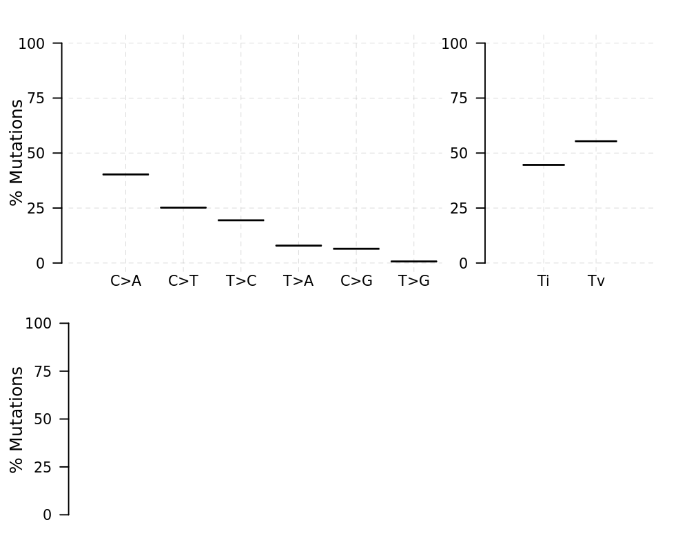
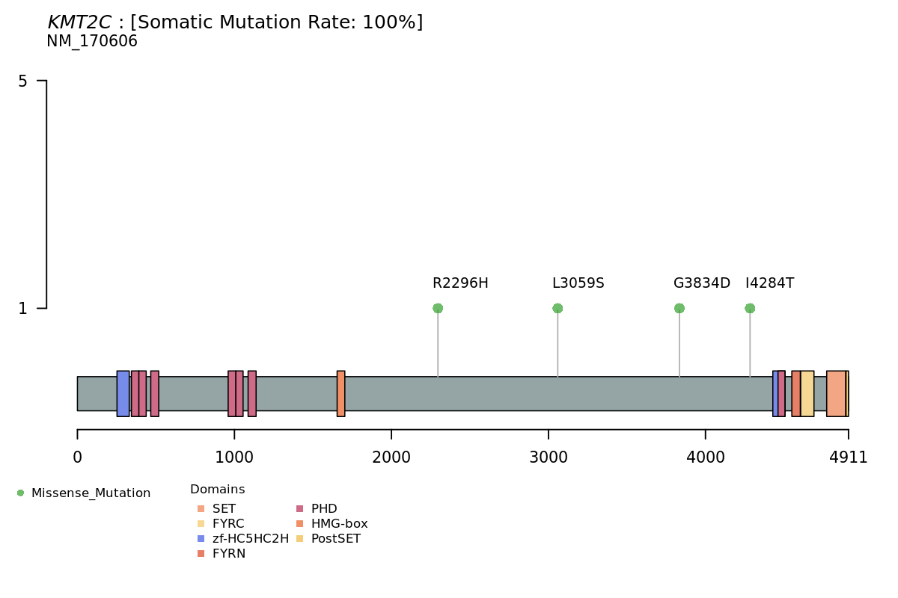

# 🧬 Somatic Variant Calling Pipeline (GATK4 Best Practices)

## 📋 Overview

This repository provides a containerized, automated pipeline for somatic variant calling from a single pair of tumor and normal high-throughput sequencing data. The workflow strictly adheres to the **GATK4 Best Practices** for Somatic Short Variant Discovery (Mutect2).

### 🎯 Objective

To identify high-confidence somatic SNVs and Indels from raw FastQ files, perform functional annotation, and generate publication-quality genomic visualizations.

---

## ⚙️ Workflow Architecture

The pipeline automates the following stages within a controlled Docker environment:

1. **Preprocessing**: Adapter trimming and quality filtering via `fastp` ⚡
2. **Alignment**: Read mapping to the `hg38` reference genome using `BWA-MEM` 🔍
3. **GATK Post-processing**: Duplicate marking (`MarkDuplicates`) and Base Quality Score Recalibration (`BQSR`) 🛠️
4. **Somatic Calling**: Variant discovery via `Mutect2` (Tumor-Normal mode) 🧪
5. **Refinement**: Contamination estimation, orientation bias filtering, and hard filtering (`FilterMutectCalls`) 🧹
6. **Annotation**: Functional effect prediction using GATK `Funcotator` 🏷️
7. **Visualization**: Statistical summary and oncogenic plotting via R `maftools` 📊

---

## 📂 Project Structure

To maintain a lightweight repository, large genomic data (FastQ, BAM, VCF) are excluded from version control via `.gitignore`.

```text
.
├── Dockerfile               # Image build instructions
├── environment.yml          # Conda dependency definitions
├── run_pipeline.sh          # Master orchestration script
├── scr/                     # Modular processing scripts
├── doc_images/              # Curated result plots for documentation 🖼️
└── .gitignore               # Prevents tracking of local data (reads/, results/)

```

---

## 🛠️ Installation & Usage

### 1. Clone and Build

Build the image from the project root:

```bash
git clone https://github.com/yourusername/somatic_variant_calling.git
cd somatic_variant_calling
sudo docker build -t somatic-pipeline:v1 .

```

### 2. Data Preparation 📦

The pipeline is designed to be self-sufficient regarding genomic resources.

* **Reads**: Provide raw data in the `reads/` directory:
* `SRR7890918_1/2.fastq.gz` (Normal/Blood)
* `SRR7890919_1/2.fastq.gz` (Tumor/Breast Cancer)


* **Resources**: The script includes **automated download logic** for the `hg38` Reference FASTA, BWA index, GnomAD, and PON files. These will be stored in `resources/` upon the first execution.

### 3. Execution 🚀

Run the container by mounting your local workspace to the internal `/pipeline` path:

```bash
sudo docker run --rm \
  -v "$(pwd)/reads:/pipeline/reads" \
  -v "$(pwd)/resources:/pipeline/resources" \
  -v "$(pwd)/results:/pipeline/results" \
  -v "$(pwd)/plots:/pipeline/plots" \
  -v "$(pwd)/aligned_reads:/pipeline/aligned_reads" \
  somatic-pipeline:v1

```

---

## 🧪 Demo & Validation

The demonstration utilizes **subsetted FastQ reads** from **SRR7890918** (Normal) and **SRR7890919** (**Breast Cancer** tumor) to ensure rapid workflow validation.

### ✨ Expected Results

The pipeline successfully captures the mutational landscape of the Breast Cancer sample:

* **Ti/Tv Ratio**: Validates the transition/transversion ratio typical of the expected mutational signature for this cancer type.
* **Driver Mutations**: Successfully identified a high-impact somatic variant in **KMT2C**, a gene frequently associated with genomic instability and chromatin remodeling in Breast Cancer.

### 🖼️ Visualization Samples

The following outputs are automatically generated by the visualization module:

| Mutation Summary | Ti/Tv Distribution | Lollipop Plot (KMT2C) |
| :---: | :---: | :---: |
|  |  |  |
| *Overall variant statistics* | *Substitution patterns* | *KMT2C mutation site* |

---

## ⚠️ Technical Limitations

* **Single-Pair Only**: Optimized for 1-Tumor vs. 1-Normal analysis; does not support multi-sample cohort processing.
* **Absolute Paths**: Volume mounting requires absolute host paths as per Docker specifications.

---

